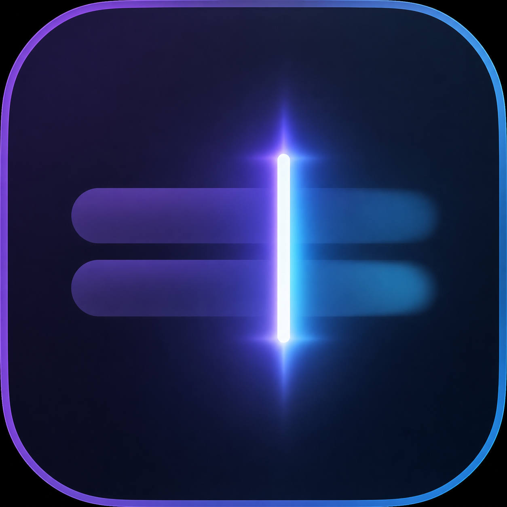

<p align="center">
  
</p>

<h1 align="center">nodaystypst</h1>

<p align="center">
  Cloud-powered predictive typing for macOS—quiet at the caret, light on your Mac.
</p>

<p align="center">
  <strong>Native Swift 6</strong> · <strong>Gemma 4 via OpenRouter</strong> · <strong>No local model</strong>
</p>

## What it does

nodaystypst watches the text field you are actively writing in, sends a short bounded context window to OpenRouter, and displays a subtle 2–4-word completion beside the caret. Press **Tab** to accept the next word. Keep typing to dismiss it.

The current release is intentionally focused on two verified writing surfaces:

- **Orion Browser** (`com.kagi.kagimacOS`)
- **Antinote** (`com.chabomakers.Antinote`)

Every other app stays content-blind and inactive: no field-value read, prediction request, learning update, overlay, or Tab interception.

## Why it feels lightweight

- Inference runs in the cloud through OpenRouter—no GGUF, MLX, llama.cpp, or model weights.
- The default model is locked to `google/gemma-4-26b-a4b-it` and routed for latency with reasoning disabled.
- An 80 ms debounce, one in-flight request, cancellation, generation checks, and a four-second timeout prevent stale completions.
- The menu-bar app has no Dock presence and targets an idle footprint well below 100 MB.

## Learns your writing—without keeping your writing

nodaystypst gradually adapts to repeated vocabulary, short phrases, punctuation, capitalization, and sentence-length tendencies.

It does **not** store documents, messages, chronological typing history, secure-field contents, or AI-inserted completions. The local profile contains bounded aggregate counters, is encrypted with AES-GCM, and uses a random key stored in Keychain. Learning can be disabled or reset globally or per supported app.

## Privacy and safety

| Contract | Behavior |
| --- | --- |
| API credential | Stored in macOS Keychain only |
| Network | OpenRouter prediction requests only |
| Context | Short bounded text around the caret |
| Secure fields | Blocked before content capture or prediction |
| Unsupported apps | Content-blind and inactive |
| Overlay | Non-activating and click-through |
| Untrusted geometry | Hide instead of guessing |
| Logging | Field contents are not logged by default |

## Requirements

- macOS 15 or newer
- Apple silicon or Intel Mac supported by Swift 6
- An [OpenRouter](https://openrouter.ai/) API key
- Accessibility permission for cross-app reading and accepted-text insertion

No paid Apple Developer account is required to build the app locally. Local builds are ad-hoc signed and are not notarized for public binary distribution.

## Build from source

```bash
git clone https://github.com/nodaysidle/nodaystypst.git
cd nodaystypst
swift test
MENU_BAR_APP=1 Scripts/package_app.sh release
open Nodaystypst.app
```

The packaged app is created at `Nodaystypst.app` in the repository root. To install it locally:

```bash
ditto Nodaystypst.app /Applications/Nodaystypst.app
```

Because the app uses a local ad-hoc signature, replace its entry in **System Settings → Privacy & Security → Accessibility** after rebuilding the executable.

## First run

1. Launch `Nodaystypst.app`.
2. Open its menu-bar item and choose **Open Settings…**.
3. Save your OpenRouter key in the secure field.
4. Grant Accessibility access to the exact installed app path.
5. Write in Orion or Antinote, pause briefly, and press Tab when the grey completion appears.

## Architecture

```text
AccessibilityObserver ──► SecureFieldGate ──► CompletionCoordinator
        │                                             │
        │                                     PredictClient
        │                                      (OpenRouter)
        ▼                                             │
   FieldAdapter ◄──────── AcceptInsert ◄────── GhostOverlay
        │
        └── WritingStyleStore (encrypted aggregate profile)
```

The implementation is a native SwiftPM menu-bar executable with SwiftUI for settings and AppKit/ApplicationServices for Accessibility, overlay placement, and insertion.

## Verification

The automated suite covers secure-field blocking, bounded context, UTF-16-safe insertion, adapter trust, cancellation/generation policy, 2–4-word output, encrypted personalization, supported-app isolation, and icon-aware packaging.

Run everything with:

```bash
swift test
```

Live release checks are performed in Orion and Antinote. A field must either show a correctly aligned ghost or safely show nothing—misaligned output is never accepted as a fallback.

## Project status

This is an early macOS release focused on a small, reliable surface rather than claiming universal app support. The product direction is simple: start useful, learn repeated writing tendencies over normal use, and stay out of the way everywhere else.

---

Built by [NODAYSIDLE](https://github.com/nodaysidle).
